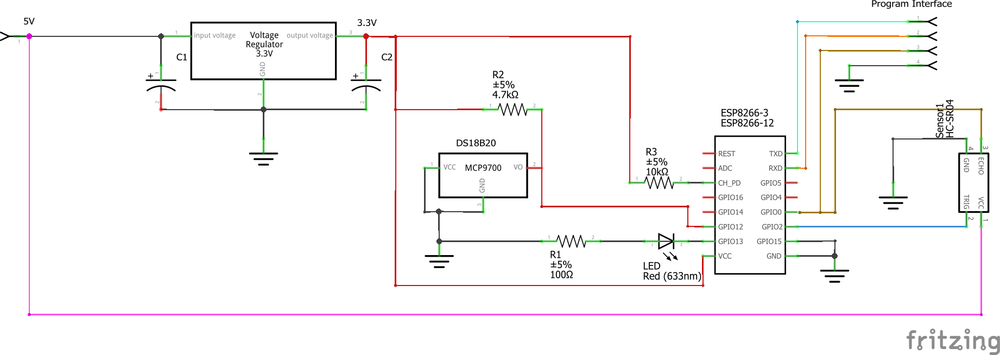
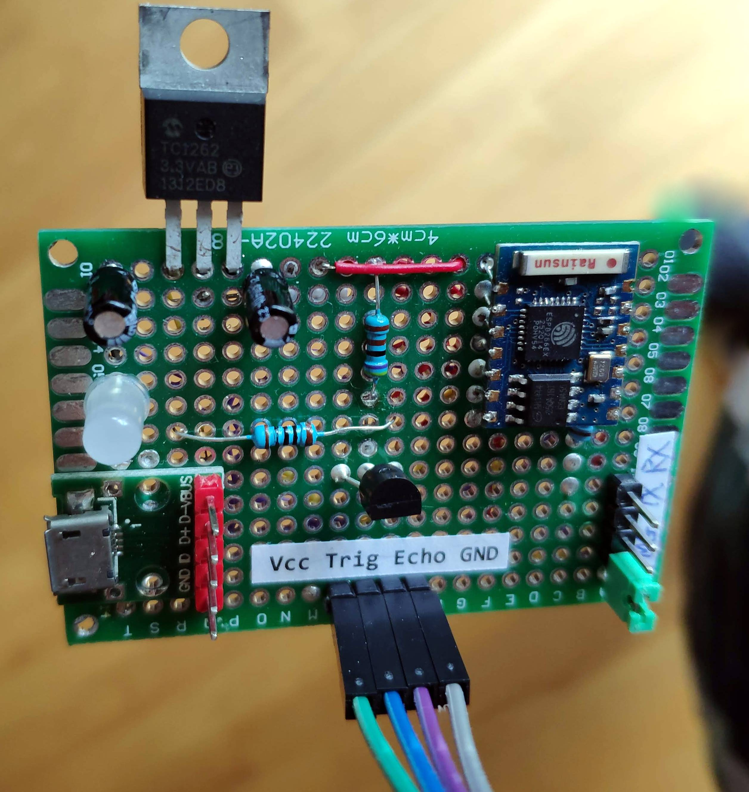
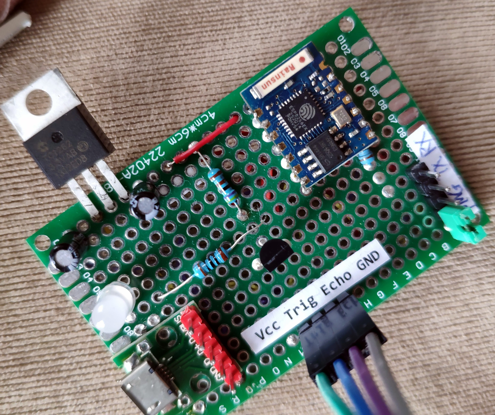

# Garage Door Monitor

## Overview

Most of old garage doors were not equipped with smart monitor, sometimes the garage door left open without notice.This simple monitor gadget will solve the problem, and monitor the garage door 24x7. 

## IOT host

The ESP8266 module will periodically read a value from the distance sensor, and upload the value to thinkspeaks.com.
The readings are consumed by a Springboot application which process the data, and send the notification accordingly.

## Part List

- ESP8266-3 module
- HC-SR04 Distance sensor
- MicroUSB port and power supply (Max output 1A)
- Connector pins and cables
- Blue LED 5mm
- Resistors
- PBC prototype board

## Schematic

The circuit diagram for the Garage Door Monitor 

## Circuit Board

The circuit board was build on a 4cm x 6cm PBC prototype board. The input power is connected to a micro USB port which delivers a 5V to the TC1262 3.3V voltage converter.

